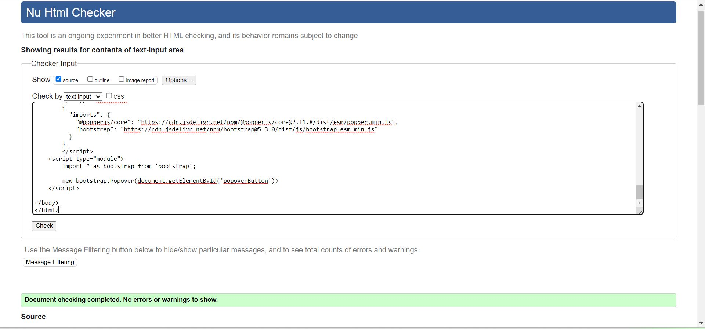
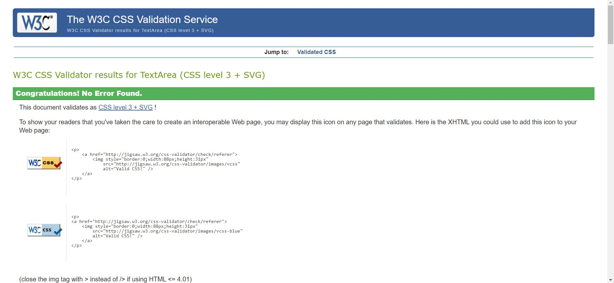

# About Wine

## General information

This website was built to facilitate the production of wine at home in 3 simple steps. Contains information about the necessary equipment and its use, the choice of fruits, their preparation and the fermentation process.

## User stories

  The purpose of this website is to provide information about the wine process.
   Such as:
  * home page with information about the steps taken to obtain the wine
  * a gallery of images
  * a sign up page to stay in contact with people who want to test the quality of the wine
  * contact to social media pages for more information and improvements of the wine production process

  ## Features

### Features left to implement:

* Another section in the *Home* page with further details in the process of making wine
* More styling for *Section 2* situated in *index.html* for heading and paragraphs
* Improving the performance of the website

## Technologies used to build

* HTML
* CSS
* Bootstrap

## Testing

* [W3C Validator Html](https://validator.w3.org/) for index.html, gallery.html, form.html

* [W3C CSS Validation](https://jigsaw.w3.org/css-validator/)

* Tested on Google Chrome for performance and compatibility on media devices

* Tested manual on Firefox and Microsoft Edge

## Code

